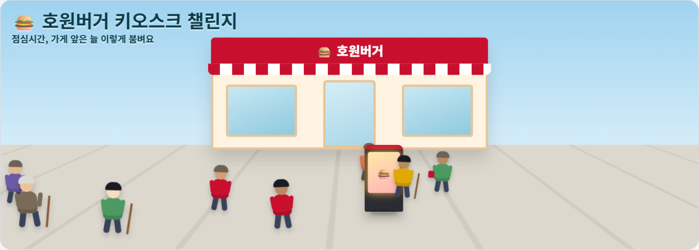
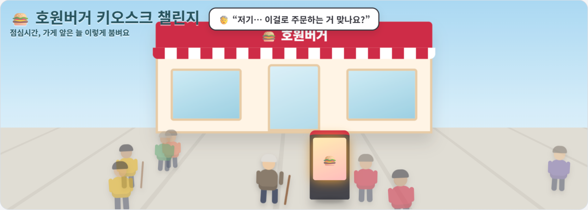
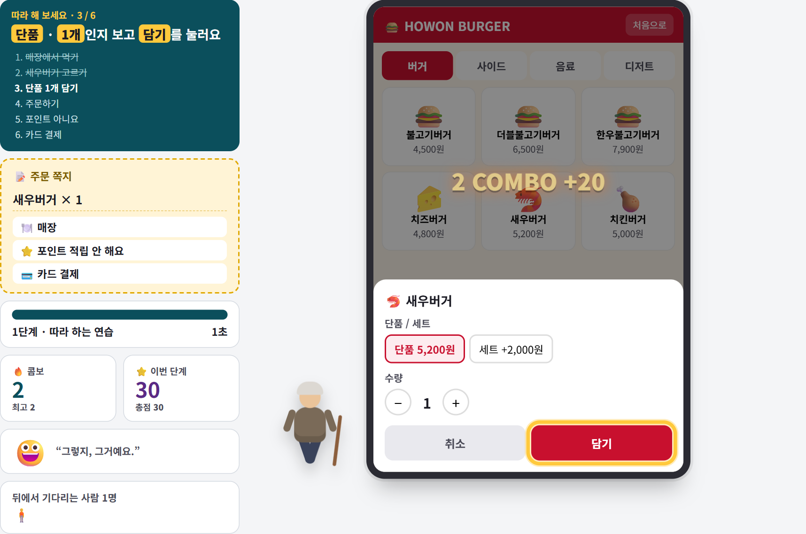
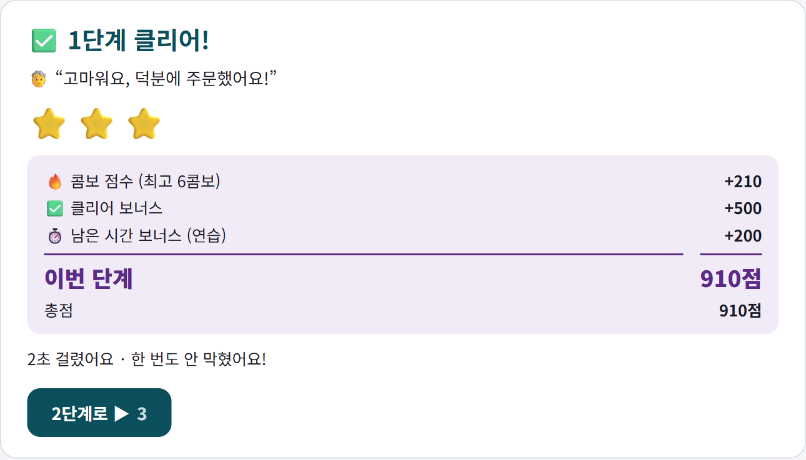
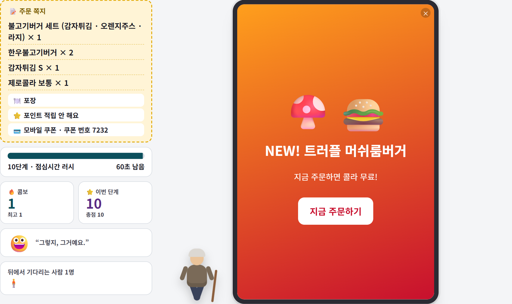

# 🍔 호원버거 키오스크 챌린지

**키오스크 앞에서 할아버지가 겪는 일을, 학생이 직접 겪어 보는 웹 게임입니다.**
HTML 파일 **하나**로 되어 있어요. 설치도, 서버도, 라이브러리도 없습니다.

### ▶ [지금 해 보기 — ict-kiosk-challenge.netlify.app](https://ict-kiosk-challenge.netlify.app)



---

## 왜 만들었나

중학교 3학년 교양 45분, 주제는 「정보 통신 기술에서 소외받는 사람들 이해」였습니다.
"어르신들은 키오스크가 어렵대요"라는 말을 열 번 듣는 것보다, **한 번 막혀 보는 편**이 빠르겠다 싶었어요.

그래서 시작 버튼을 누르면 **지팡이를 짚은 할아버지가 키오스크 앞까지 걸어와 섭니다.**
거기서부터 플레이어가 그 할아버지예요.



마지막에 이렇게 묻습니다.

> **"주문한 사람은 똑같은 여러분이었어요. 달라진 건 무엇이었나요?"**

---

## 어떻게 하는 게임인가

왼쪽 **주문 쪽지**에 적힌 그대로 주문하면 클리어예요. 쪽지와 다르면 **결제까지 갈 수 없습니다.**
1단계는 한 걸음씩 알려 주는 연습이고(누를 곳에 노란 테두리), 2단계부터 시간이 붙습니다.



안 틀리고 쭉 맞게 누르면 🔥 **콤보**가 오르고, 5콤보마다 **+3초**를 받습니다.
클리어하면 점수가 나옵니다 — `콤보 점수 + 클리어 500 + 남은 초 × 40`.



**쪽지는 할 때마다 새로 뽑힙니다.** 메뉴 · 옵션 · 매장/포장은 물론
**포인트 적립(전화번호)** 과 **결제 방법(카드 / 모바일 쿠폰+번호 4자리 / 간편결제)** 까지 매번 달라져요.
외워서 넘길 수 없고, 매번 쪽지를 읽어야 합니다.

---

## 진짜는 여기부터 — 단계마다 '장벽'이 하나씩 붙습니다

주문 자체는 조금씩만 길어집니다. 대신 **실제 키오스크에서 사람들이 겪는 일**이 하나씩 추가돼요.

| 단계 | 붙는 장벽 | 시간 |
|---|---|---|
| 1 따라 하는 연습 | — (설명대로만 누를 수 있음) | 없음 |
| 2 여러 개 담기 | 수량 바꾸기 | 35초 |
| 3 세트 고르기 | 세트를 고르면 사이드 · 음료 · 크기를 또 고름 | 40초 |
| 4 여러 메뉴판 | 버거 · 사이드 · 음료가 다른 칸에 있음 | 45초 |
| 5 광고와 팝업 | 2초간 안 닫히는 광고, "세트로 바꾸시겠어요?" | 50초 |
| 6 작은 글씨 | 글씨 작음 · 그림 없음 · 이름 비슷 · 순서 섞임 | 50초 |
| 7 모르는 말 | 화면이 전부 영어 | 50초 |
| 8 재촉하는 줄 | 뒷사람이 재촉, **8초 멈추면 처음 화면으로** | 40초 |
| 9 떨리는 손, 흐린 눈 | 화면이 흔들리고 흐림 | 55초 |
| 10 점심시간 러시 | 위의 장벽이 **한꺼번에** | 60초 |



장벽은 **플레이 중에는 알려 주지 않습니다.** 끝나고 나서 "이번 단계에 붙은 것"으로 보여 줘요.
학생은 대개 "내가 못했다"고 느끼다가, 결과 화면을 보고 **화면 탓이었다는 걸** 알게 됩니다.

### 그리고 — 고쳐서 다시

마지막 화면에서 학생이 **키오스크를 고칠 수 있습니다.**
글씨 크게 · 한국어로 · 광고 끄기 · 흔들림 없애기 · 시간 제한 없애기 · 눌러 주면 소리로 읽기.
켜고 같은 단계를 다시 하면, **고치기 전과 후의 시간 · 막힌 횟수 · 점수**가 나란히 나옵니다.

여기서 마지막 질문이 하나 더 남습니다 —
**"실제 키오스크 앞에 선 사람은, 이걸 스스로 켤 수 있을까요?"**

---

## 써 보기

세 가지 방법 중 편한 걸로 하세요.

1. **그냥 링크로** — [ict-kiosk-challenge.netlify.app](https://ict-kiosk-challenge.netlify.app) 을 학생에게 알려 주면 끝
2. **파일로** — `index.html` 을 내려받아 **더블클릭**. 인터넷이 없어도 됩니다
3. **내 주소로 올리기** — [Netlify Drop](https://app.netlify.com/drop) 에 `index.html` 을 끌어다 놓으면 몇 초 만에 내 주소가 생겨요

주소 뒤에 이런 걸 붙일 수 있어요.

| | |
|---|---|
| `?stage=7` | 그 단계부터 바로 시작 (1~10) — **수업 시연할 때** |
| `?fixed=1` | 쪽지를 고정 (매번 같은 주문) |

---

## 고쳐 쓰기

`index.html` 을 메모장으로 열어도 됩니다. 고칠 곳은 두 군데뿐이에요.

**메뉴 바꾸기** — 우리 학교 급식실·매점 메뉴로 바꾸면 훨씬 재밌어집니다.

```js
burger: [
  {id:'bulgogi', ko:'불고기버거', en:'Bulgogi Burger', price:4500, em:'🍔'},
  {id:'cheese',  ko:'치즈버거',   en:'Cheese Burger',  price:4800, em:'🧀'},
  // ← 이 줄들을 바꾸면 메뉴가 바뀝니다 (em 은 그림 대신 쓰는 이모지)
]
```

**단계 · 시간 · 장벽 바꾸기** — 시간이 짧다 싶으면 숫자만 올리면 됩니다.

```js
{title:'작은 글씨', time:50, barrier:'글씨가 작고, 그림이 없고, 이름이 비슷해요',
 fx:{small:true, noimg:true, shuffle:true}, gen:()=>[ ... ]},
//        ↑ 이 장벽 스위치들을 켜고 끄면 단계 성격이 바뀝니다
```

쓸 수 있는 장벽 스위치: `ads`(광고) · `upsell`(세트 권유) · `small`(작은 글씨) · `noimg`(그림 없음) ·
`shuffle`(순서 섞기) · `en`(영어) · `rush`(재촉) · `reset`(N초 멈추면 초기화) · `shake`(흔들림) · `blur`(흐림)

---

## 만든 방법 (별거 없습니다)

- **파일 하나, 라이브러리 0개.** 외부 글꼴도 이미지도 안 씁니다 — 그림은 전부 이모지와 CSS
- **3D도 CSS입니다.** Three.js 같은 건 안 썼어요. 부모에 `perspective`, 자식에 `translateZ` 를 주면
  뒤에 있는 건 작게, 앞에 있는 건 크게 — 그게 전부입니다. 거리의 사람들은 `translateZ` 값만 다른 `<div>` 예요
- **캐릭터도 `<div>`** 입니다. 머리 · 몸 · 팔 · 다리를 둥근 사각형으로 만들고, 팔다리에 `rotate` 를 번갈아 주면 걷습니다
- **저장이 없습니다.** 점수는 그 브라우저 화면에만 있고 서버로 아무것도 보내지 않아요 (학교에서 쓰기 편하라고)

학교 크롬북(구형)에서 돌아가는 걸 기준으로 만들었습니다. 그래서 무거운 걸 뺐어요.

---

## 수업에서 쓸 때

- 점수는 **게임 점수**입니다. 성적과 무관하다고 먼저 말해 주세요. 반 전체 점수를 비교하지 않습니다
- 45분이면 — 게임 20분 / 관련 영상 8분 / 「고쳐서 다시」 8분 / 마지막 질문 4분 정도로 돌아갑니다
- **9단계(흔들림 · 흐림)** 는 어지러움을 느끼는 학생이 있으면 **바로 넘어가도 된다**고 미리 안내해 주세요
- 「소리로 읽기」는 이어폰이 없으면 교실이 시끄러워집니다
- 발표시키지 말고, 질문만 던지고 속으로 생각하게 하는 편이 좋았습니다

---

## 라이선스

MIT. **마음껏 가져다 고쳐 쓰세요.** 학교 이름, 메뉴, 단계 전부 바꾸셔도 됩니다.
고쳐서 더 나아진 게 있으면 알려 주시면 반갑겠습니다.
